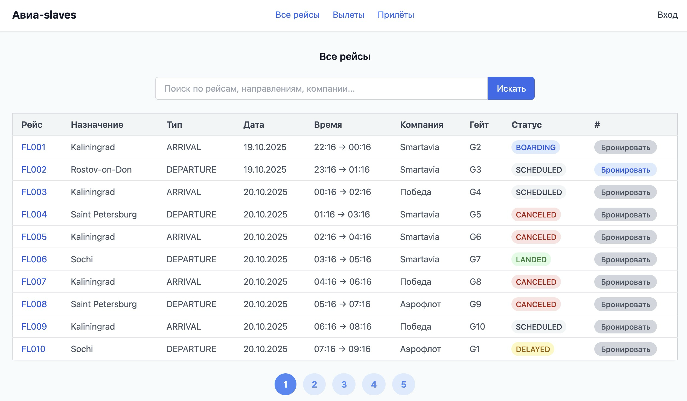
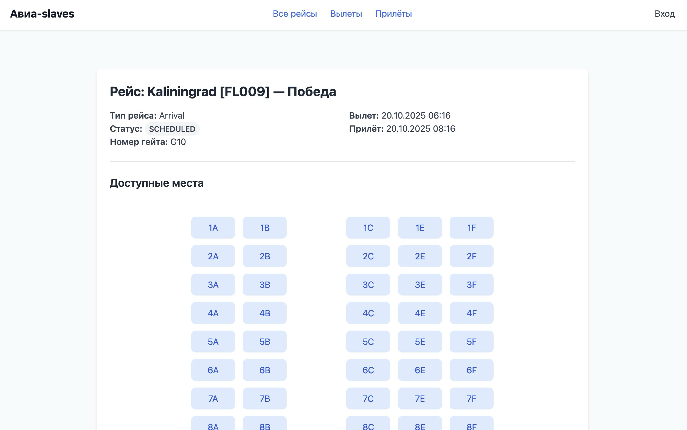

**HTML-страницы (рендер шаблонов):**

- `GET /` — главная страница (редирект на /flights).
- `GET /flights` — список рейсов (пагинация, фильтры, поиск).
  
- `GET /flights/detail/{flight_id}` — страница конкретного рейса.
  
- `GET /auth` — страница входа.
  
- `GET /auth/register` — страница регистрации.
  

**API-эндпоинты (работа с данными):**

- `POST /review` — добавить отзыв (`flight_id`, `rating`, `comment`).
- `POST /auth/login` — вход пользователя (`email`, `password`).
- `POST /auth/register` — регистрация (`last_name`, `first_name`, `patronymic?`, `email`, `password`).
- `GET /auth/logout` — выход пользователя.
- `POST /book` — забронировать место (`seat_id`, `flight_id`).
- `POST /book/delete` — удалить бронь (`seat_id`, `flight_id`).

Дополнительная информация доступна по [http://localhost:8000/docs](http://localhost:8000/docs).
